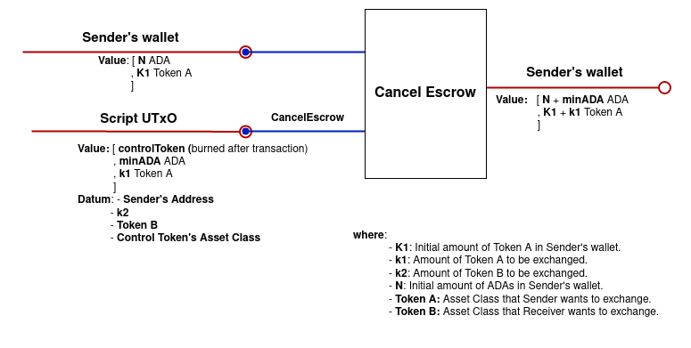
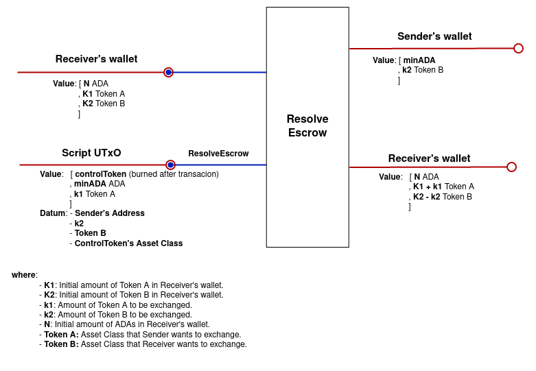

# Simple Escrow dApp Design

## Overview

The Simple Escrow dApp will be implemented in the Cardano blockchain using Plutus Scripts.

Each time a user starts an escrow, a new script UTxO is created, containing in the datum the information of this particular instance: payment details together with the sender addresses. A special *control Token* is minted each time a new escrow instance is started, ensuring that the produced UTxO is well-formed and the information is right. The Asset Class of this Token is also stored in the datum to check it is burned when the escrow is cancelled or resolved.

The script is parameterized by the receiver address.  This allows each user to find all escrows they need to resolve more quickly.

The *control Token* Minting Policy is parameterized by the contract address.

When an escrow instance is canceled or resolved, the corresponding UTxO is spent, and funds go to the corresponding wallet addresses. The control Token is burned.

## Script UTxO

### **Address**

The script is parameterized by the receiver address. So that each user can find the escrows they need to resolve.

### **Datum**

- Sender’s address
- The amount and asset class of the receiver’s payment
- Asset Class of the Control Token

### **Value**

- Control Token
- The sender’s tokens to exchange
- min-ADA

## Transactions

### **Start**

In this transaction, a user locks the tokens they want to exchange and specifies the tokens they want to receive and from whom. The control Token is minted.

### **Cancel**

The user can cancel the escrow and receive the locked tokens back. The control Token is burned.

### **Resolve**

The other user pays `k2` Token `B`, closing the script and burning the control token. Each user gets the corresponding tokens.

## Validator Scripts

### **Script Validator**

Validates the transactions that involve spending the **script UTxO**: Cancel and Resolve.

In the **Cancel operation**, the validator checks:

- The address that is trying to cancel the escrow is the same as the Sender’s address
- The control token is burned after the transaction

In the **Resolve operation** the validator checks:

- The address that is trying to resolve is the same as the Receiver’s address
- The Sender’s address receives the tokens specified on the datum
- The control token is burned after the transaction

### **Control Token minting policy**

The token minting policy is parametrized by the contract address and has the following checks:

**Minting:**

- Only one token with the correct token name is minted
- The sender’s address is signing the transaction
- The token is paid to the contract address

**Burning:**

- One token is being burned
